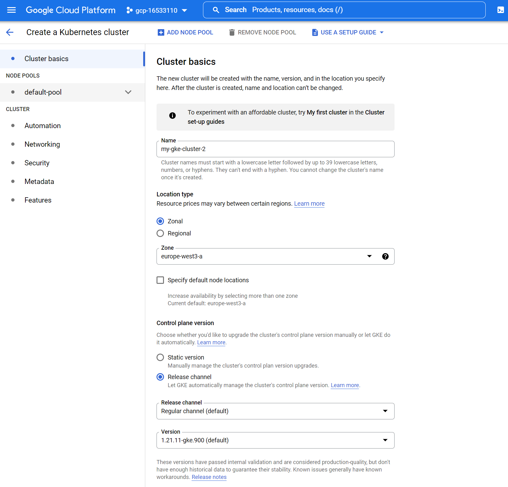

# Cloud Bites Tutorial
<br><br><br><br><br>
The idea of ​​the tutorial is to give an introduction to the basics of application deployment in a cloud native environment. A simple website serves as a sample application, this website can be run as a container in various cloud environments. The source code of the sample application is part of the tutorial. The idea is to continuously develop this tutorial. In a first chapter, the basics of container technology, deployment and management of container applications are outlined. This first chapter consists of several parts that build on each other. In a second chapter, the idea is to have a broader look at the ecosystem e. g. various projects from the [Cloud Native Computing Foundation](https://www.cncf.io/) cosmos are going to be discussed.  
For simplicity make sure not to be behind a corporate firewall. Comments, additions and collaboration are welcome.
***

## **Chapter 1 - Basics of container technology, deployment and management of container applications**

### **1. Setup of local environment**
In order to have a consistent development environment, a virtual machine (VM) is provided in the tutorial. This VM is deployed using [Vagrant](https://www.vagrantup.com/), vagrant allows it to leverage a declarative configuration file which describes all the required software, packages, operating system configuration. The VM used in this tutorial is based on Ubuntu 20.4 LTS. The VM is allocated 1 vCPU and 4 GB of RAM.
[Virtualbox](https://www.virtualbox.org/) is recommended as the virtualization software for this tutorial.
As a code editor, this tutorial uses [Visual Studio Code](https://code.visualstudio.com/).  

After the three components - Vagrant, Virtualbox, Visual Studio Code - have been installed, the GitHub repository can be cloned and the VM can be started:
```
git config --global core.autocrlf false
git clone
cd cloud_bites_tutorial
vagrant up
```
After the VM has started and all software components have been fully installed, you can log into the VM via ssh: 
```
vagrant ssh
```
The VM has been configured to mount the host PC's file system, this is available under the *vagrant* folder:
```
cd /vagrant
```
***
### **2. Build and run Docker container locally**
In this section, a container with the demo application is created first. This container is started locally and can be reached via the web browser of the host PC.

Switch to the directory:
```
cd cloud_bites_tutorial/1_2_app_sources
```
View the container images available in the VM:
```
docker images
```
Build the container image based on the Dockerfile located in the folder:
```
docker build -t <image_name> .
docker images
```
Running the Docker container. With the following command the container runs in the background and the VM ports 8082 are mapped to the container port 80. The website is available via the Host PC's web browser at *localhost:8082*:
```
docker run -d -p 8082:80 <image_name>
```

With the help of a small helper script, the source code of the sample application can be easily modified. This helper script is run twice and the container image is also rebuilt twice. The commands shown start new containers with the newly generated container images. The website is then available via the host PC's web browser under *localhost:8083* and *localhost:8084*:
```
./update_script.sh
docker build -t <image_name_2> .
docker run -d -p 8083:80 <image_name_2>
./update_script.sh
docker build -t <image_name_3> .
docker run -d -p 8084:80 <image_name_3>
```

Running containers can be listed and stopped with the following commands:
```
docker ps
docker kill <container_id>
```

If you have an account on Docker Hub, the created container images can be pushed to the container registry. The container image must contain the Dockerhub username. Therefore, the container image may need to be rebuilt or named appropriately via a tag:
```
docker login
docker push <dockerhub_username>/<image_name>
```
***
### **3. Deploy a local Kubernetes cluster using K3D**
In the following section we will use the [K3D](https://k3d.io) project to locally deploy a minimal Kubernetes cluster. K3D is a lightweight wrapper to run [K3S](https://k3s.io), Rancher Lab’s minimal Kubernetes distribution, in Docker. K3D makes it very easy to create single- and multi-node K3S clusters in Docker, e.g. for local development on Kubernetes. A good introduction with some use cases can be found in the [DevOps Toolkit YouTube video](https://www.youtube.com/watch?v=mCesuGk-Fks).  

Deploy a local K3D cluster with 3 controlplane and 3 worker nodes:
```
k3d cluster create local-cluster --servers 3 --agents 3 -p "8080:80@loadbalancer"
```

The cluster and the individual nodes can be displayed with the following commands:
```
k3d cluster list
kubectl get nodes
```

With the following command, the demo application is deployed to the local Kubernetes cluster that has just been created. This step creates a deployment with multiple containers, a service, and an ingress. The declarative configuration can be found in the `1_3_local_deployment/deployment.yml` file:
```
kubectl apply -f 1_3_local_deployment/deployment.yml
```

The following command displays the deployment, the replica set, the pods, and the service:
```
kubectl get deployments,replicasets,pods,services
```
The website is then available via the host PC's web browser under *localhost:8080*.

***
### **4. Basic operations to handle Pods and Deployments**
The following section is about getting to know a few basic commands for handling pods and deployments. The following commands create two pods named `my-pod-1` and `my-pod-2` each with container image `nginx:alpine`. The last command shows all pods running in the default namespace:
```
kubectl run my-pod-1 --image=nginx:alpine
kubectl run my-pod-2 --image=nginx:alpine
kubectl get pods
```

The following command will stop and delete the pod named `my-pod-1`. Since this pod is not part of a ReplicaSet, it will not be restarted:
```
kubectl delete pod my-pod-1
kubectl get pods
```

The following command scales the deployment created in the previous section to 6 replicas. The second command displays the deployment, the replica sets, and the pods in the default namespace. Now 6 pods should be displayed for the `dpl-demo-1`:
```
kubectl scale deployment dpl-demo-1 --replicas=6
kubectl get deployments,replicasets,pods
```
Now it's time to change the deployment. To do this, the `1_3_local_deployment/deployment.yml` file must be modified. For example, in line 24, the container image can be changed from `demo-app:sydney` to `demo-app:london`. The adjusted deployment is rolled out again with the following command:
```
kubectl apply -f 1_3_local_deployment/deployment.yml
kubectl get deployments,replicasets,pods
```
The second command displayed the deployment, the replica sets, and the pods for the default namespace. By rolling out the changed deployment, a new replica set was created in which the number of pods is scaled up to the required number of pods. For the existing replica set, the number of pods is scaled to zero.
The deployment is changed a second time and rolled out again. To do this, the container image is changed from `demo-app:london` to `demo-app:newyork` in line 24 of the `1_3_local_deployment/deployment.yml` file. The adjusted deployment is rolled out again with the following command:
```
kubectl apply -f 1_3_local_deployment/deployment.yml
kubectl get deployments,replicasets,pods
```
Keep in mind: the website of the demo application is always available via the host PC's web browser via *localhost:8080*.  
The following command shows a list of revisions for the `dpl-demo-1` deployment. The second command displays details for a specifiv revision:
```
kubectl rollout history deployment dpl-demo-1
kubectl rollout history deployment dpl-demo-1 --revision=2
```
To roll back the deployment to a specific revision use the following command: 
```
kubectl rollout undo deployment dpl-demo-1 --to-revision=2
```
If the deployment is rolled back, the number of pods for the corresponding ReplicaSet is scaled, which means that no new ReplicaSet is created but an existing one is used.
***
### **5. Deploy a remote Kubernetes cluster using Google Cloud – part 1**
In the following section, a Kubernetes cluster is deployed in a public cloud. For this purpose, [Google Cloud](https://cloud.google.com/) is used in this tutorial, for the sake of simplicity it is assumed that a Google Cloud account already exists.  
Important: in the following parts of the tutorial, costs are generated at the public cloud provider used. To minimize costs, it is therefore important to limit the runtime of the clusters and to prevent possible idle time.  

First obtain access to your Google Cloud account:
```
gcloud init --console-only
```

The following command creates a new Google Cloud project. A random project name is generated. Lastly, the newly created project is specified in the active configuration.
```
PROJECT_ID="gcp-$(($(date +%s%d)/1000000))$(($RANDOM%20))" && echo $PROJECT_ID
gcloud projects create ${PROJECT_ID} --name "${PROJECT_ID}"
gcloud config set project ${PROJECT_ID}
```

Before moving on with the Tutorial make sure to [enable billing](https://cloud.google.com/billing/docs/how-to/modify-project#enable_billing_for_a_new_project) on the new project.  

Then the Kubernetes cluster can be deployed. In a first step, required Google Cloud APIs are activated:
```
gcloud services enable compute.googleapis.com cloudresourcemanager.googleapis.com container.googleapis.com
gcloud beta container --project ${PROJECT_ID} clusters create "my-gke-cluster" --zone "europe-west3-a"
```

In order do be able to interact with the newly created Kubernetes Cluster you have to fetch its credentials:
```
gcloud container clusters get-credentials my-gke-cluster --zone europe-west3-a --project ${PROJECT_ID}
```

Now the demo application can be deployed on the newly created cluster:
```
kubectl apply -f 1_5_cloud_deployment/deployment.yml
```
A load balancer is created as a service in the previous step. After a certain waiting time, a public IP address is displayed. The website of the demo application can then be reached via a web browser:
```
kubectl get services
```

The Kubernetes cluster can be deleted with the following command:
```
gcloud container clusters delete my-gke-cluster --zone europe-west3-a
```
***
### **6. Deploy a remote Kubernetes cluster using Google Cloud – part 2**
In this section, another Kubernetes cluster is created on Google Cloud. This time the so-called Cloud Console is used:



Once the Kubernetes Cluster was created successfully you can proceed to fetch its credentials:
```
gcloud container clusters get-credentials my-gke-cluster-2 --zone europe-west3-a --project ${PROJECT_ID}
```

Now the demo application can be deployed on the newly created cluster:
```
kubectl apply -f 1_5_cloud_deployment/deployment.yml
```
A load balancer is created as a service in the previous step. After a certain waiting time, a public IP address is displayed. The website of the demo application can then be reached via a web browser:
```
kubectl get services
```

Here, too, it is important to delete the Kubernetes cluster if it is not used in order to keep costs low.

***
### **7. Deploy a remote Kubernetes cluster leveraging Terraform**
In this section a Kubernetes cluster is created on Google Cloud leveraging [Terraform](https://www.terraform.io). Terraform is an infrastructure as code tool that allows one to build infrastructure on various platforms safely and efficiently in a declarative way.  
First the Google Cloud environment has to be prepared by enabling a couple of API's:
```
gcloud services enable compute.googleapis.com container.googleapis.com
```

The next command authorizes the Google Cloud SDK to access Google Cloud using your user account credentials. Finally, this step adds your account to the Application Default Credentials. This will allow Terraform to access these credentials to provision resources on Google Cloud:
```
gcloud auth application-default login
```

The following command initializes a working directory containing Terraform configuration files:
```
cd 1_7_terraform_deployment
terraform init
```

The **terraform plan** command creates an execution plan, which lets you preview the changes that Terraform plans to make to your infrastructure. By default, when Terraform creates a plan it:  
- Reads the current state of any already-existing remote objects to make sure that the Terraform state is up-to-date.
- Compares the current configuration to the prior state and noting any differences.
- Proposes a set of change actions that should, if applied, make the remote objects match the configuration.
With the following command you are going to create a Terraform plan, you have to pass the project ID generated earlier as a variable:
```
terraform plan -var project_id=${PROJECT_ID}
```
The **terraform apply** command executes the actions proposed in a Terraform plan.
```
terraform apply -var project_id=${PROJECT_ID}
```

Once the Kubernetes Cluster was created successfully you can proceed to fetch its credentials:
```
gcloud container clusters get-credentials my-terraform-cluster --region europe-west3 --project ${PROJECT_ID}
```

Now the demo application can be deployed on the newly created cluster:
```
kubectl apply -f 1_5_cloud_deployment/deployment.yml
```
A load balancer is created as a service in the previous step. After a certain waiting time, a public IP address is displayed. The website of the demo application can then be reached via a web browser:
```
kubectl get services
```

The **terraform destroy** command is a convenient way to destroy all remote objects managed by a particular Terraform configuration.
```
terraform destroy -var project_id=${PROJECT_ID}
```

If you don't need your Google Cloud project anymore you can proceed and delete the project:
```
gcloud projects delete ${PROJECT_ID}
```
***
### **8. Visualize Kubernetes workloads with VMware Octant**
In this section you are going to explore the various Kubernetes Cluster created earlier with [VMware Octant](https://octant.dev/). Octant is a tool for developers to understand how applications run on a Kubernetes cluster. It aims to be part of the developer's toolkit for gaining insight and approaching complexity found in Kubernetes. Octant offers a combination of introspective tooling, cluster navigation, and object management along with a plugin system to further extend its capabilities.  

Start Octant:
```
octant
```
The Octant application can be reached via a web browser of the host PC using *localhost:8001*.
***